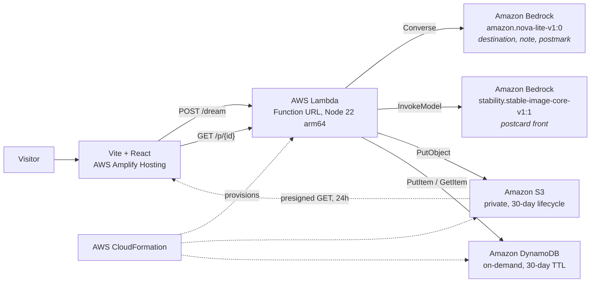

# Architecture

## Request flow

1. The browser posts `dreamText` (max 500 chars, validated at the handler boundary).
2. The handler claims one unit of the **daily image budget** — an atomic DynamoDB counter with a
   conditional update. This runs *before* any paid model call, so a spent budget costs nothing.
3. Nova Lite returns the postcard text plus a `scene` description written for an illustrator.
4. Stable Image Core paints `scene` at 3:2, the postcard aspect ratio.
5. The PNG goes to a private S3 bucket; the metadata goes to DynamoDB with a 30-day TTL.
6. The response carries a 24-hour presigned URL. The image bytes never pass through the API response.

## Why it is shaped this way

| Choice | Instead of | Why |
|---|---|---|
| Lambda Function URL | API Gateway | One fewer resource, CORS built in, nothing here needs a gateway |
| Presigned S3 GET | CloudFront + OAC | No distribution to provision or wait on, bucket stays private |
| One handler, two routes | Two functions | The routing is a regex; two deployables is not worth it |
| DynamoDB TTL | Scheduled cleanup job | Expiry is a table setting, not a codebase |
| `us-west-2` | `us-east-1` | The only checked region with an ACTIVE text-to-image model |

## Cost control

Image generation is the only meaningful cost. Three guards, in order:

1. Input capped at 500 characters before it reaches a model.
2. Daily image cap (`DAILY_IMAGE_CAP`, default 200) claimed atomically before generating.
3. Exactly one image per request — no batching, no generation on retry.
