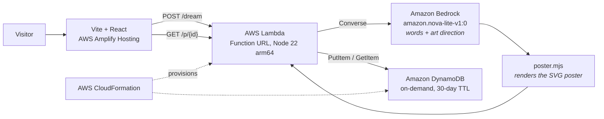

# Architecture

## Request flow

1. The browser posts `dreamText` (max 500 chars, validated at the handler boundary).
2. The handler claims one unit of the **daily budget** — an atomic DynamoDB counter with a
   conditional update. This runs *before* the model call, so a spent budget costs nothing.
3. Nova Lite returns the postcard words plus art direction: an `archetype` (mountains, city, waves,
   forest, arches), a `palette`, the sun height, and how many birds are in the sky.
4. `poster.mjs` clamps that art direction to a fixed vocabulary and draws a layered mid-century
   travel poster as SVG, seeded by the postcard id so it always redraws identically.
5. Words and poster go to DynamoDB with a 30-day TTL, and straight back to the browser.

## Why there is no image model

The original design called Amazon Nova Canvas. On this account it returns `ResourceNotFoundException`
because the provider marked it LEGACY. The Stability text-to-image models are third-party AWS
Marketplace models and fail with `INVALID_PAYMENT_INSTRUMENT`. No image model was reachable.

Rather than block, the illustration became code: the model art-directs and the renderer draws.
Letting the model emit raw SVG was tried first and produced scattered rectangles. Constraining it to
a parameter vocabulary over a hand-written renderer looks composed every time — and it is free,
instant, deterministic, about 1.7 KB per poster, and immune to prompt injection because no model
output is ever interpreted as markup.

## Why it is shaped this way

| Choice | Instead of | Why |
|---|---|---|
| Lambda Function URL | API Gateway | One fewer resource, CORS built in, nothing here needs a gateway |
| SVG in DynamoDB | PNG in S3 | 1.7 KB fits the item; no bucket, no presigning, no expiry to manage |
| One handler, two routes | Two functions | The routing is a regex; two deployables is not worth it |
| DynamoDB TTL | Scheduled cleanup job | Expiry is a table setting, not a codebase |
| Hash routing | A router dependency | Permalinks are one regex on `location.hash` |
| `us-west-2` | `us-east-1` | Widest Nova availability after the region survey |

## Cost control

1. Input capped at 500 characters before it reaches a model.
2. Daily cap (`DAILY_CARD_CAP`, default 500) claimed atomically before the model call.
3. Artwork costs nothing — it is rendered, not generated.
