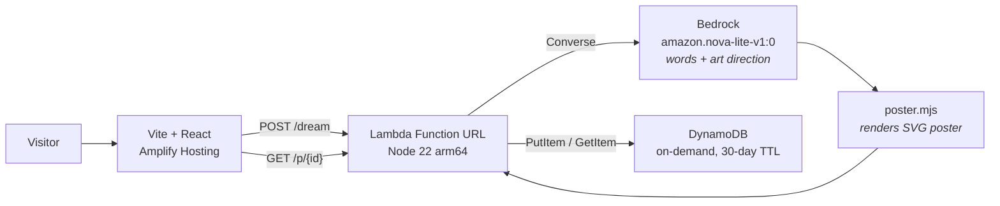

# Weekend Creative Challenge: Dream Postcards

#creative-expression

## Vision & what the app does

Dreams are the most vivid places most of us will ever visit, and we forget them by lunchtime. Dream
Postcards is a small act of tourism for them.

You type one dream into a box — "I kept trying to post a letter into a lighthouse, but the slot was
full of moths" — and you get back a vintage travel postcard from wherever you went. The front is a
mid-century travel poster of an invented destination: **GREETINGS FROM THE MYSTERIOUS BEACON**. Click
the card and it turns over. On the back is a handwritten note from your dream self, always ending
mid-thought, stamped and cancelled by the Postal Service of the Subconscious and postmarked from an
impossible place on an impossible date.

Every postcard gets a permalink, so the one thing your brain did at 3 a.m. becomes something you can
send to a friend.

## How I built it

The plan was ordinary: a large language model writes the words, an image model paints the front. I
spent the first hour proving the models worked before writing a line of application code — which is
the only reason the weekend survived.

That check failed immediately. `amazon.nova-canvas-v1:0` returned:

```
ResourceNotFoundException: This Model is marked by provider as Legacy and you have not
been actively using the model in the last 30 days.
```

So I surveyed regions with `ListFoundationModels` and found no text-to-image model ACTIVE in
`us-east-1` at all. `us-west-2` had Stability's models, and a CLI call there returned a real 3.7 MB
PNG. I moved the whole project to `us-west-2` and built on that.

Then the deployed Lambda failed:

```
AccessDeniedException: Model access is denied due to INVALID_PAYMENT_INSTRUMENT
```

Stability's models are third-party AWS Marketplace models. They need a payment instrument on the
account regardless of service credits, and my IAM user lacked `aws-marketplace:Subscribe`. My earlier
CLI success had slipped through while the subscription was still provisioning. Every reachable image
model was now a dead end.

Rather than stall, I made the illustration *code*. Nova Lite still writes the postcard, but it also
**art-directs** the front: it picks a landscape archetype (mountains, city, waves, forest, arches), a
palette, how high the sun sits, and how many birds are in the sky. A renderer I wrote turns that
direction into a layered SVG travel poster, seeded by the postcard's ID so it always redraws
identically.

I did try letting the model emit raw SVG. It produced scattered rectangles. Constraining it to a
parameter vocabulary over a hand-written renderer looks composed every single time — and it is free,
instant, about 1.7 KB per poster, and immune to prompt injection, because no model output is ever
interpreted as markup. Untrusted values get clamped to the allowed vocabulary before they reach the
renderer, so a hostile `archetype` degrades into a nice poster instead of into the DOM.

The last bug was pure CSS. Clicking the card showed a *mirrored front* instead of the back. A
`filter: drop-shadow` on the card had flattened its 3D rendering context, silently disabling
`backface-visibility`. Moving the shadow onto the faces fixed it.

## AWS services used / architecture overview

| Service | Role |
|---|---|
| Amazon Bedrock | Nova Lite writes the postcard and art-directs the front |
| AWS Lambda | one Node 22 arm64 handler behind a Function URL |
| Amazon DynamoDB | postcard store plus an atomic daily budget counter, 30-day TTL |
| AWS Amplify Hosting | serves the Vite + React frontend |
| AWS CloudFormation | provisions the stack via the SAM transform |
| AWS IAM | scopes the Lambda to exactly one model ARN |



I kept the infrastructure deliberately lazy, and each shortcut earned its place. A Lambda Function
URL instead of API Gateway: one less resource, CORS built in. SVG in the DynamoDB item instead of a
PNG in S3: no bucket, no presigning, no expiry to manage. One handler for two routes, because the
routing is a regex. DynamoDB TTL instead of a cleanup job, because expiry is a table setting rather
than a codebase. Hash-based permalinks instead of a router dependency.

Input is capped at 500 characters at the handler boundary, and a daily cap is claimed atomically in
DynamoDB *before* the model call, so a spent budget costs nothing.

## What I learned

**A model appearing in `ListFoundationModels` does not mean you can call it.** Check
`modelLifecycle.status` — LEGACY models are listed and unusable.

**Third-party Marketplace models are a different access path from Amazon's own.** Service credits do
not satisfy `INVALID_PAYMENT_INSTRUMENT`, and the caller needs `aws-marketplace:Subscribe`.

**Amazon Nova Pro and Premier need an inference profile ID**, like `us.amazon.nova-pro-v1:0`. A bare
model ID returns `ValidationException`.

**Small models pad JSON with prose.** Nova Lite opened a reply with "Understood, here is your reply:"
after being told to return JSON only. Slicing to the outermost braces is more reliable than better
prompting.

**A constraint made the product better.** Losing image generation forced a design where the model
art-directs and deterministic code draws. That version is cheaper, faster, reproducible, and safer
than the one I set out to build.

## Link

**Live app:** https://main.d5c14kpdhh5ai.amplifyapp.com

**Source:** https://github.com/mahanteshimath/aws-builder-Challenge-Aug-14

Type a dream, wait a moment, then click the postcard to read the back.
